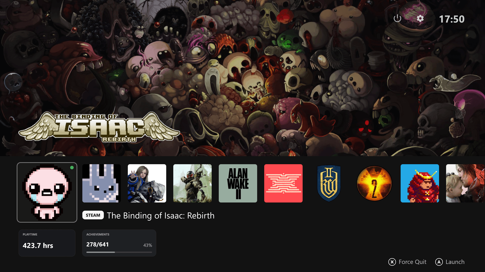
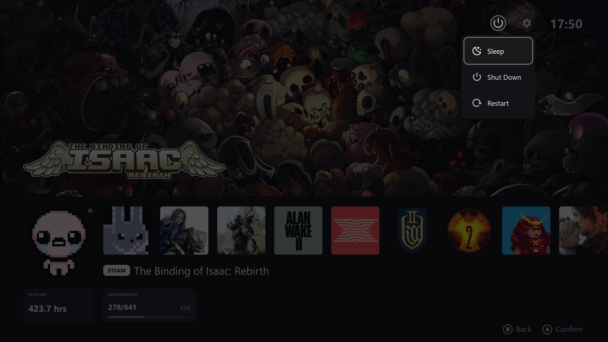
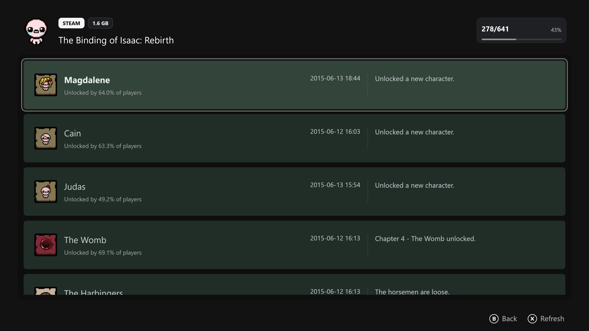
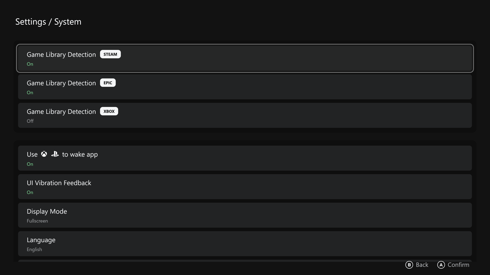

# Big Screen Launcher

[简体中文](./README.zh-cn.md)

[License](./LICENSE) / [许可说明](./LICENSE.zh-cn.md)

[Privacy Policy](./PRIVACY.md) / [隐私政策](./PRIVACY.zh-cn.md)

A controller friendly game launcher on Windows, built with Rust and eframe (egui), designed to deliver a console-like experience on PC.

## Features

- Library support
	- Detects locally installed Steam games and supports viewing achievement lists.
	- Detects locally installed Epic games.
	- Detects locally installed Xbox games.
- Controller support
	- Xbox controllers (XInput)
	- DualSense over USB
- Supports returning from games with the Xbox Home / PS button
- Supports controller vibration feedback in the app UI
- Smooth page animations
- Launch at system startup
- System power actions: shut down, sleep, and restart

## Screenshots









## Development

Enable the versioned Git hooks once per clone:

```sh
git config core.hooksPath .githooks
```

The pre-commit hook formats staged Rust files with `rustfmt` and re-stages them automatically. If formatting removes all staged Rust changes, the commit is stopped so you can review before retrying.

## License

This project is licensed under the GNU General Public License v3.0 (GPLv3). See [LICENSE](./LICENSE) for the authoritative license text and [LICENSE.zh-cn.md](./LICENSE.zh-cn.md) for a Chinese explainer.
