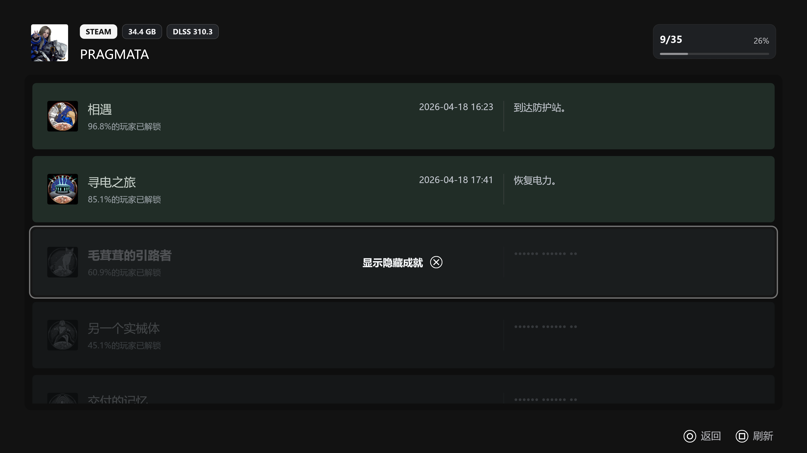
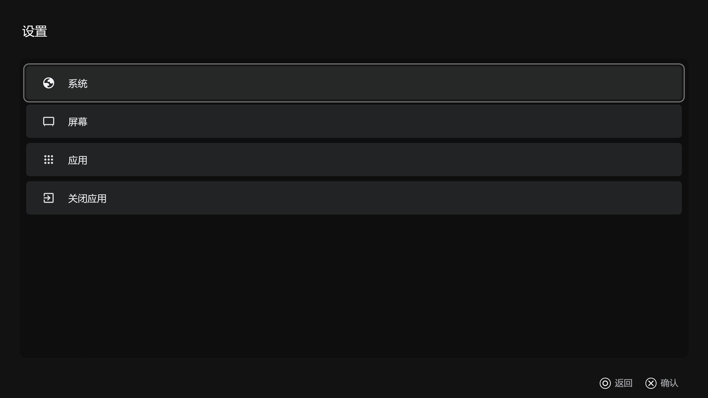
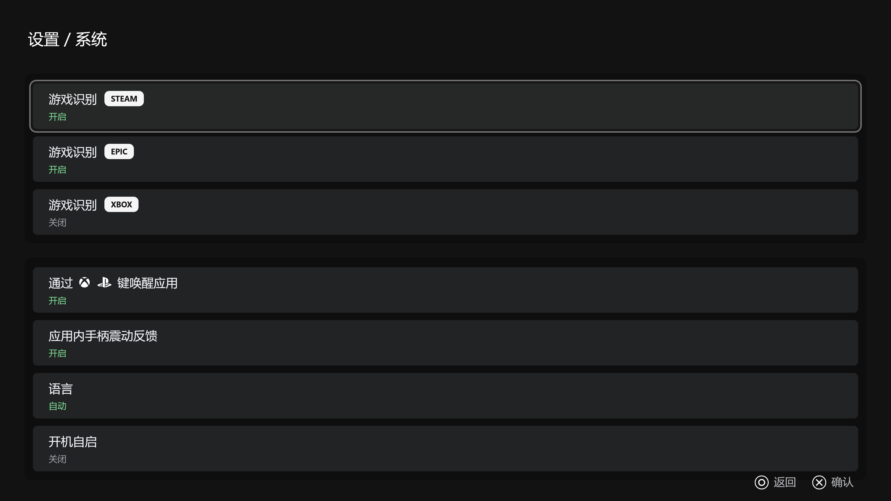

# Big Screen Launcher

一个面向手柄交互优先设计的 Windows 游戏启动器，使用 Rust 与 eframe（egui）构建，旨在为 Windows玩家提供接近家用游戏主机风格的使用体验。

## 功能特性

- 游戏库支持
    - 可检测本地已安装的 Steam 游戏，并支持显示成就列表。
    - 可检测本地已安装的 Epic 游戏
    - 可检测本地已安装的 Xbox 游戏
- 手柄支持
    - Xbox 手柄（xinput）
    - DualSense USB 连接
- 支持在游戏中通过 Xbox Home / PS 键返回
- 支持应用内界面的手柄震动反馈
- 流畅的页面动画效果
- 支持开机启动
- 支持对系统电源的关机、睡眠、重启操作

## 截图

## 许可证

本项目采用 GNU General Public License v3.0（GPLv3）许可证，详情请参见 LICENSE。
