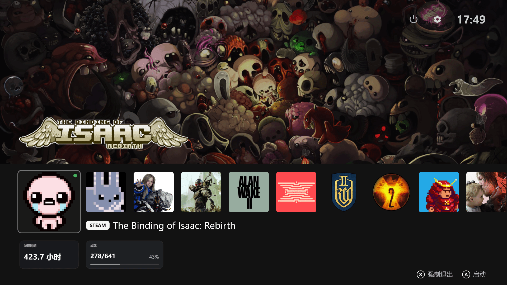
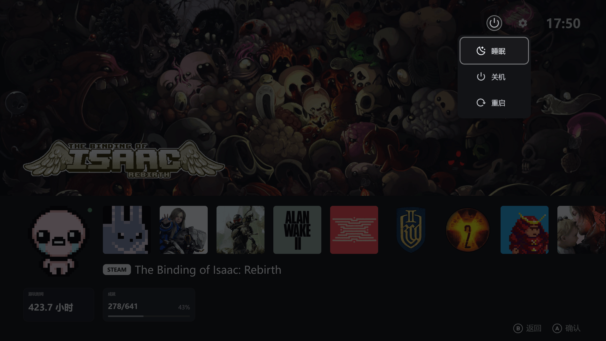
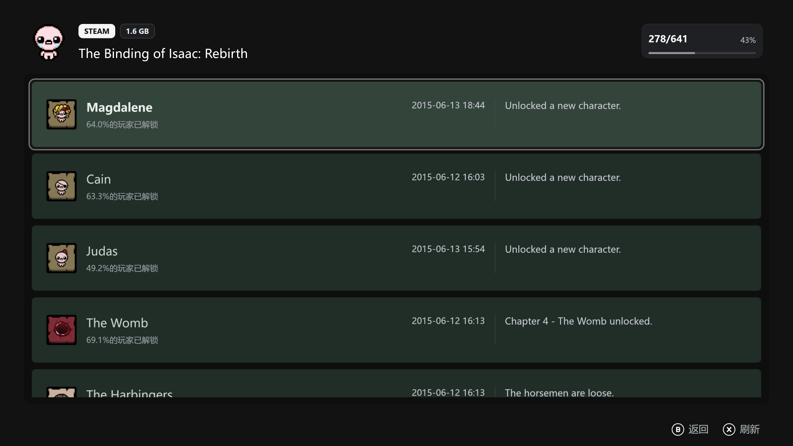
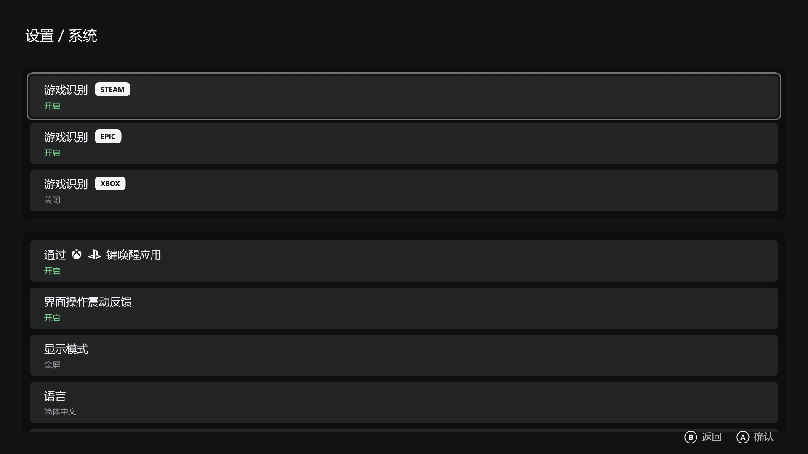

# Big Screen Launcher

[English Version](./README.md)

[许可说明](./LICENSE.zh-cn.md) / [License](./LICENSE)

[隐私政策](./PRIVACY.zh-cn.md) / [Privacy Policy](./PRIVACY.md)

一个专为手柄体验设计的轻量 Windows 游戏启动器，使用 Rust 与 eframe（egui）构建，旨在为 Windows 玩家提供接近家用游戏主机式交互体验。

## 功能特性

- 游戏库支持
    - 可检测本地已安装的 Steam 游戏，并支持显示成就列表。
    - 可检测本地已安装的 Epic 游戏
    - 可检测本地已安装的 Xbox 游戏
- 手柄支持
    - Xbox 手柄（xinput）
    - DualSense USB 连接
- 支持在游戏中通过 Xbox Home / PS 键返回
- 支持应用内界面的手柄震动反馈
- 流畅的页面动画效果
- 支持开机启动
- 支持对系统电源的关机、睡眠、重启操作

## 截图









## 开发

每次 clone 后执行一次下面的命令，启用仓库内维护的 Git hooks：

```sh
git config core.hooksPath .githooks
```

当前的 pre-commit hook 会在提交前自动用 `rustfmt` 格式化已暂存的 Rust 文件，并把格式化结果重新加入暂存区。如果格式化后已暂存的 Rust 改动为空，提交会被拦下，方便你确认后再提交。

## 许可证

本项目采用 GNU General Public License v3.0（GPLv3）许可证。正式许可证文本请参见 [LICENSE](./LICENSE)，中文说明请参见 [LICENSE.zh-cn.md](./LICENSE.zh-cn.md)。
